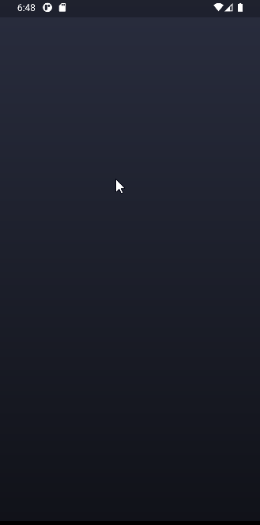

# Tetris

시작은 단순했지만, 이젠 그리 단순하지만은 않은 테트리스 앱

* 인트로 화면
* 스와이프로 블록을 이동, 회전, Drop, Hold 처리
* 설정화면 (배경, 색상, 블록모양, 사운드 등 설정)
* 온라인 연동 점수표
* 게임 레벨링 (점수, 스테이지)

## Preview
 

[데모앱(Webapp)](https://grollcake.github.io/flutter-webapp/tetris)

## Technical notes

* Provider를 이용하여 화면과 로직을 분리
* Drop과 Fixing 효과를 주기 위해 Animation 사용
* 좀 더 자연스러운 스와이프 조작을 위해 Listener를 이용하여 Swipe 모듈 작성
* 입체적인 블록 모양을 위해 ClipPath와 BoxShadow 이용
* 아크릴 반투명 효과의 Dialog
* 온라인 점수표는 Firestore로 구현
* 사운드 효과 추가 (PWA에서는 잘 작동하지 않음)
* 자연스럽게 움직이는 배경을 Lottie로 구현
* emailjs 서비스를 통해 사용자 피드백을 메일로 수신

## Packages

* animate_do: 인트로 화면에서 블록이 시간차를 두고 나타나는 효과 구현에 사용
* font_awesome_flutter: 게임화면의 아이콘
* pausable_timer: 일시중지 가능한 타이머
* url_launcher: 깃허브 저장소 연결
* shared_preferences: 설정 사항을 기기에 저장
* audioplayers: 배경음악 플레이
* cloud_firestore: 온라인 점수표 자료 저장
* fluttertoast: 신기록 알림 용도
* provider: 화면과 로직의 분리
* soundpool: 효과음 처리
* http: 피드백 이메일
* lottie: 움직이는 배경

## Lessons learned
* 애니메이션 개념 및 구현방법 확실히 학습!

* 앱 아이콘 변경

* AppBar가 없을 때 Gridview.builder 사용 시 상단 고정 Padding 생기는 것 방지하는 방법

  ```dart
  MediaQuery.removePadding(
       removeTop: true,
       context: context,
       child: GridView.builder()
  ```

* 반투명한 다이얼로그 생성 방법

* 안드로이드 뒤로가기 버튼 비활성화

  ```dart
  WillPopScope(
    onWillPop: () async => false,
    child: Scaffold()
  ```